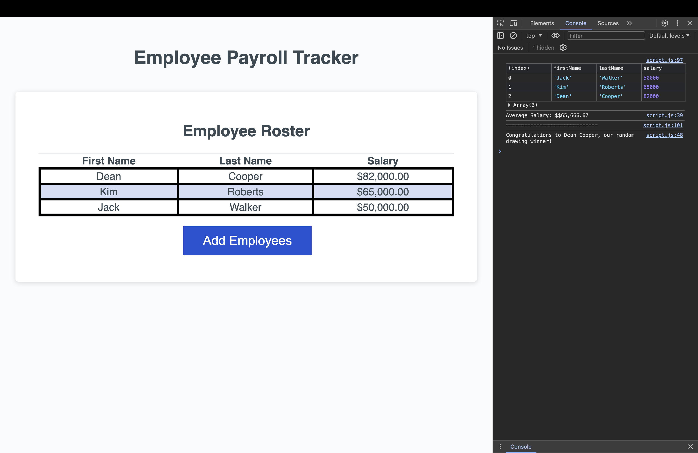

# Employee Payroll Tracker

Welcome to the Employee Payroll Tracker, a simple web-based application to track employee information and salary details. This guide outlines how to use the app to add new employees, view sorted employee data, and compute aggregated payroll information.

## Disclosure

This ChatGPT was used to create a mock README for a general outline of a README file. I then modified it to fit my needs for this challenge.

## Table of Contents

1. [Introduction](#introduction)
2. [Features](#features)
3. [How to Use](#how-to-use)
4. [Employee Data Display](#employee-data-display)
5. [Aggregate Payroll Information](#aggregate-payroll-information)
6. [Screenshot of Application](#screenshot-of-application)
7. [Link to Deployed Application](#link-to-deployed-application)

## Introduction

The Employee Payroll Tracker allows users to add employees with their first name, last name, and salary details. It provides an easy way to track payroll information, with the ability to sort and view aggregated salary data.

## Features

- Add new employees with prompts for first name, last name, and salary.
- Option to continue adding new employees or stop and display the employee list.
- Displays employee data sorted alphabetically by last name.
- Computes and displays aggregated salary data in the console.

## How to Use

To add a new employee, follow these steps:

1. Click on the "Add Employee" button.
2. Enter the employee's first name when prompted.
3. Enter the employee's last name when prompted.
4. Enter the employee's salary when prompted.

After adding the employee, you will be asked whether you want to continue or cancel:

- **Continue**: Prompts you to add another employee.
- **Cancel**: Ends the employee input process and displays the sorted list of employees on the page.

## Employee Data Display

Once you choose to cancel, the application displays the list of employees on the page, sorted alphabetically by last name. Each employee entry shows the following information:

- First Name
- Last Name
- Salary

## Aggregate Payroll Information

After the employee list is displayed, the console provides additional computed and aggregated payroll information:

- Total number of employees.
- Total sum of salaries.
- Average salary of all employees.
- Minimum and maximum salary in the employee list.

## Screenshot of Application

## Link to Deployed Application

[Link to Deployed Application](https://rp192w.github.io/Employee-Payroll-Tracker)